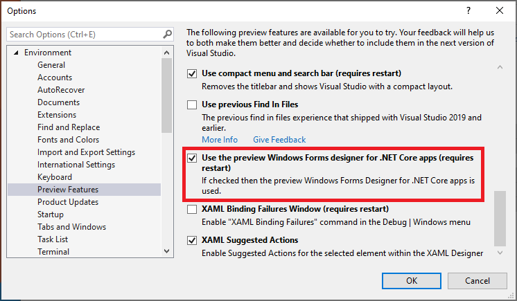

# DemoSolution
Used to demo new C# 9.0 constructs and Windows Forms Core app Forms Designer
Please make use of VS 2019 Preview when opening this solution, VS 2019 can also be used but 
`CsharpNine` project's objects may show errors'
#

## CsharpEight project
Class Library using .NET 5.0 (preview) and C# 8.0
To have the project load please make sure to download .NET 5.0 preview 4 SDK
Link to get [.NET 5.0](https://dotnet.microsoft.com/download/dotnet/5.0)

## CsharpNine project
Class Library using .NET 5.0 and C# 9.0 (both previews)
C# 9 is included with .NET 5.0 preview SDK
> Make sure to use VS 2019 Preview when loading this project (or the solution)
>> Note some constructs here still has errors, C# 9.0 is not yet fully released

## WindowsFormsApp
Windows Forms app using .NET Core, to ensure this project and objects load properly
please enable this preview feature on VS 2019:

